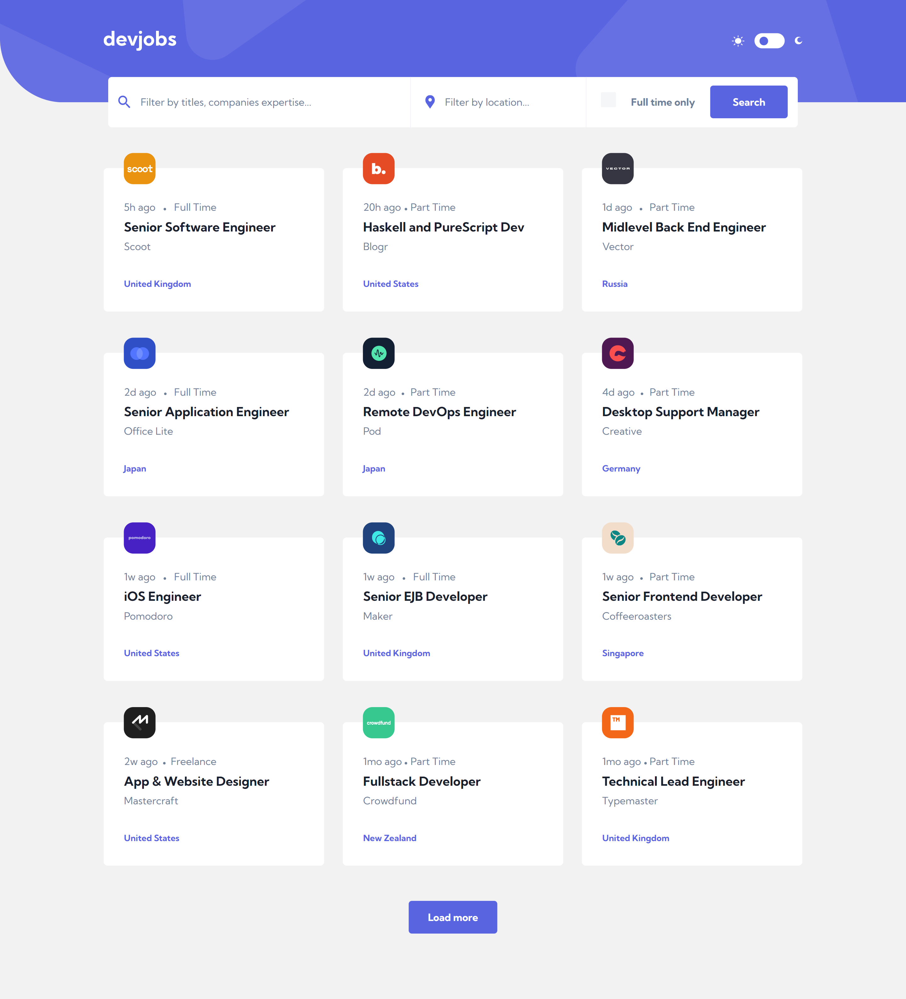
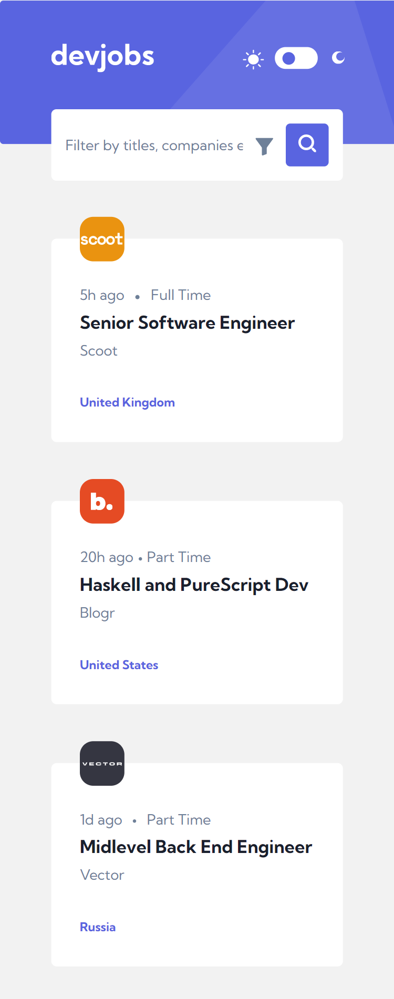

# Frontend Montor - Devjobs Web App

This is a solution to the [Devjobs web app challenge on Frontend Mentor](https://www.frontendmentor.io/challenges/devjobs-web-app-HuvC_LP4l). Frontend Mentor challenges help you improve your coding skills by building realistic projects.

## Table of contents

- [Overview](#overview)
  - [The challenge](#the-challenge)
  - [Screenshots](#screenshots)
  - [Links](#links)
- [My process](#my-process)
  - [Built with](#built-with)
- [Getting started](#getting-started)
- [Author](#author)

## Overview

### The challenge

Your users should be able to:
- View the optimal layout for each page depending on their device's screen size
- See hover states for all interactive elements throughout the site
- Be able to filter jobs on the index page by title, location, and whether a job is for a full-time position
- Be able to click a job from the index page so that they can read more information and apply for the job
- Bonus: Have the correct color scheme chosen for them based on their computer preferences. Hint: Research prefers-color-scheme in CSS.
- Bonus: Build this project as a full-stack application

### Screenshot

## Desktop view

## Mobile view

### Links

- Solution URL: [Source code](https://github.com/cwasi/devjobs-web-app)
- Live Site URL: [Live site](https://cwasi-dev-jobs.netlify.app/)

## My process

### Built with

- HTML5
- SCSS / CSS
- Javascript

## Getting Started

- run `npm install` or `npm i` to install all dependencies
- run `npm start` to run the server

## Author 👦

- GitHub - [@cwasi](https://github.com/cwasi)
- Frontend Mentor - [@cwasi](https://www.frontendmentor.io/profile/cwasi)
